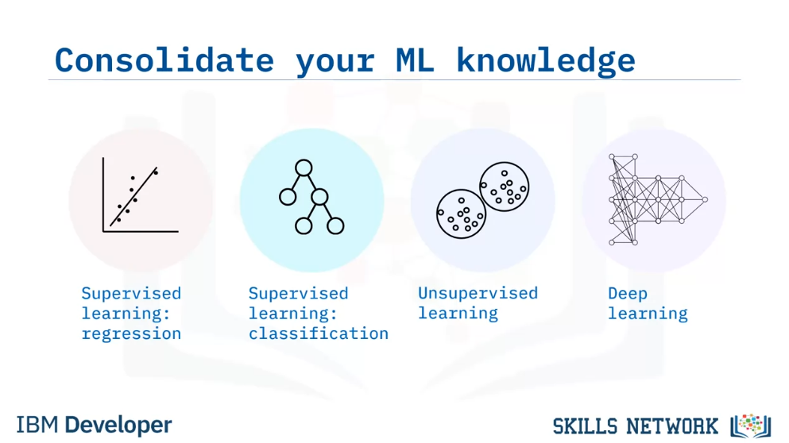
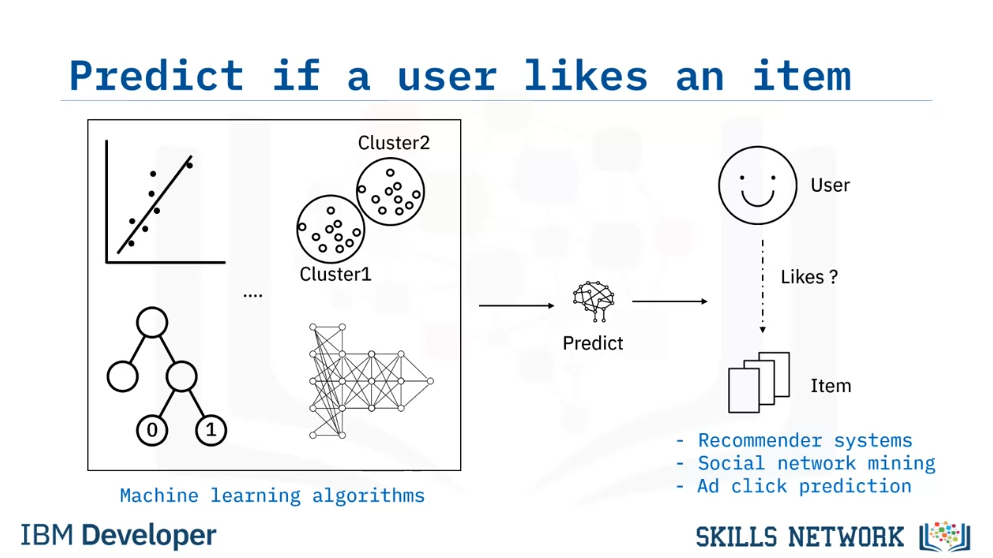
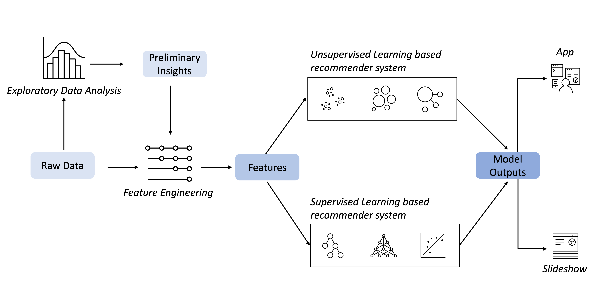
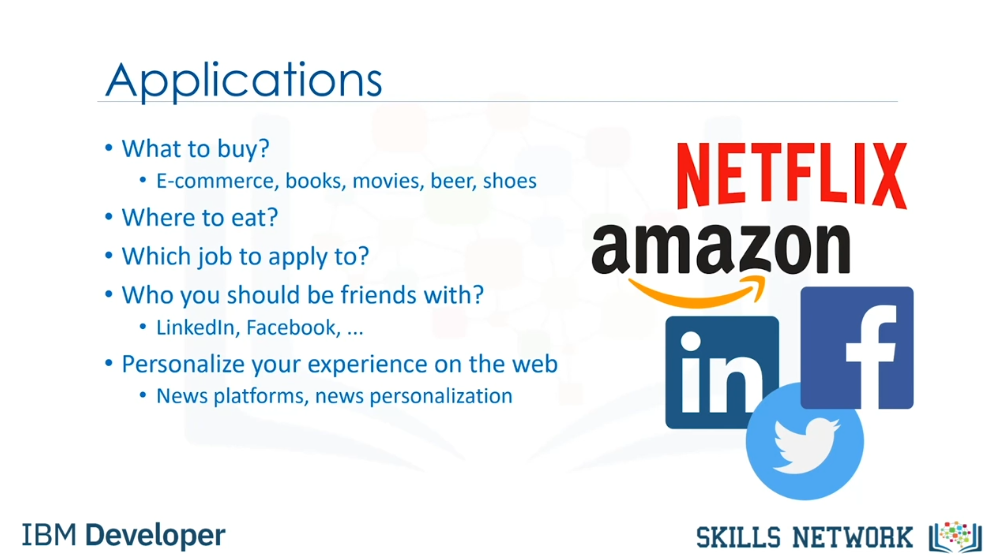

# Machine Learning Capstone

## Module 1: Machine Learning Capstone Overview
In this module, you will be introduced to the idea of recommender systems. All labs in subsequent modules are based on this concept. You will also be provided with an overview of the capstone project. You will perform exploratory data analysis to find preliminary insights such as data patterns. You will also use it to check assumptions with the help of summary statistics and graphical representations of online course-related data sets such as course titles, course genres, and course enrollments. Next, you will extract a word-count vector called a “bag of words” (BoW) from course titles and descriptions. The BoW feature is probably the simplest but most effective feature characterizing textual data. It is widely used in many textual machine learning tasks. Finally, you will apply the cosine similarity measurement to calculate the course similarity using the extracted BoW feature vectors.
Learning Objectives
Describe what a recommender system does
Develop an exploratory data analysis on course enrollment data
Write code to count the frequencies of words (bag of words) in a set of course titles
Calculate the cosine similarity between two vectors

### Introduction to Machine Learning Capstone
In the Machine Learning Capstone Project, you will have the opportunity to apply the machine learning knowledge and skills you acquired from previous courses. The project focuses on recommender systems, which are fundamental to many successful machine learning systems such as social network mining and advertising prediction. You will be asked to apply a wide range of machine learning algorithms such as regression, classification, and clustering to predict if a user will like an item or not. By completing this project, you will showcase your comprehensive machine learning skills to your peers. This capstone course will be a valuable asset to your machine learning portfolio.

  
  

### Capstone Overview
Assume you are a new machine learning engineer in a Massive Open Online Courses (MOOCs) startup called AI Training Room. In AI Training Room, learners across the world can learn leading technologies such as Machine Learning, AI, Data Science, Cloud, App development, etc. Your company grows rapidly and reaches millions of learners in a very short period.

Starting this year, your machine learning engineer team is working very hard on a
recommender system project. The main goal of this project is to improve learners’ learning experience
via helping them quickly find new interested courses and better paving their learning paths.
Meanwhile, with more learners interacting with more courses via your recommender systems,
your company’s revenue may also be increased.

This project is currently at the Proof of Concept (PoC) phase so your main focus at this moment is to
explore and compare various machine learning models and find one with the best performance in off-line evaluations.

  

### Introduction to Recommended systems
Recommendation systems capture patterns and similar behaviors to predict what users might like. They are used on websites like Amazon and Netflix to suggest books and movies. There are two main types of recommendation systems: **content-based** and **collaborative filtering**. Content-based systems recommend items similar to what the user has liked before, while collaborative filtering recommends popular items among similar users. Hybrid recommender systems combine various mechanisms. Implementing recommender systems can be done through **memory-based** or **model-based** approaches. Memory-based approaches use statistical techniques to approximate users or items, while model-based approaches develop a model of users' preferences using machine learning techniques. The main benefit of using recommendation systems is that users get exposure to different products they might be interested in, leading to a better user experience and increased revenue for service providers.

  

### Text Analysis

An Overview of Text Analysis, Techniques, and Applications
The internet hosts a wealth of unstructured data, encompassing tweets and text created by individuals.

This unstructured data lacks the organization of structured data found in databases, creating difficulties in analysis and insight extraction.

For instance, while structured data neatly fits into tables and columns, unstructured data may include text from social media posts, articles, or comments, which requires different processing techniques.

Consequently, there is an urgent demand for developing techniques and tools to extract valuable information, discern patterns, and reveal hidden insights within this expansive expanse of unstructured data. These initiatives are vital for businesses, researchers, and organizations to utilize the vast knowledge and opportunities available in the digital domain.

Text analysis is the process of examining and extracting meaningful information from unstructured text data. Text analysis addresses the challenges posed by unstructured data by employing methods such as natural language processing (NLP), machine learning, and statistical analysis to process and make sense of textual information.

#### Techniques of Text Analysis

Let's explore the text analysis stages through a use case of a fictional company, TechTrend, which manufactures and sells smartphones.

TechTrend wants to analyze customer reviews of their latest flagship smartphone model, TechTrend X1, to gain insights into consumer sentiment, identify areas for product improvement, and inform marketing strategies.

Now let's apply the Text Analysis techniques given below to solve this use case:
Let's explore the text analysis stages through a use case of a fictional company, TechTrend, which manufactures and sells smartphones.

TechTrend wants to analyze customer reviews of their latest flagship smartphone model, TechTrend X1, to gain insights into consumer sentiment, identify areas for product improvement, and inform marketing strategies.

Now let's apply the Text Analysis techniques given below to solve this use case:

1. Tokenization: Tokenization involves breaking down text into smaller units, typically words or phrases known as tokens, to facilitate subsequent analysis. This helps standardize the text data and facilitates subsequent processing steps.
2. Stopword Removal: Stopwords are common words like the, and, is, and so on, that occur frequently in text but typically do not convey significant meaning. Removing stopwords can help reduce noise and improve the quality of analysis results.
3. Stemming and Lemmatization: Stemming and lemmatization are techniques used to normalize words by reducing them to their base or root forms. This helps in collapsing variations of words to a common form, thereby reducing vocabulary size and improving analysis accuracy.
4. Word Frequency Analysis: Word frequency analysis comprises the process of counting the occurrences of individual words within a document or corpus.
5. Sentiment Analysis: Sentiment analysis is used to determine the sentiment expressed in text, such as positive, negative, or neutral. This technique is widely used for tasks like brand monitoring, customer feedback analysis, and social media sentiment analysis.
6. Named Entity Recognition (NER): NER is the process of identifying and categorizing named entities such as people, organizations, locations, dates, etc., mentioned in text. This technique is valuable for tasks like information retrieval, data extraction, and entity linking.
7. Topic Modeling: Topic modeling is a statistical technique used to identify latent topics or themes within a collection of documents. It helps in organizing and summarizing large volumes of text data and can be used for tasks like content recommendation, trend analysis, and document clustering.
8. Text Classification:Text classification involves categorizing text documents into predefined categories or labels based on their content. This technique is useful for tasks like spam detection, sentiment analysis, document tagging, and content moderation.
9. Document Summarization:
Document summarization aims to automatically generate concise summaries of lengthy text documents. It helps in extracting the main ideas and key information from documents, enabling users to quickly grasp their contents.

#### Applications of Text Analysis
Here are a few examples showcasing the diverse applications of Text Analysis:

- Understanding Customer Feedback: Analyzing customer reviews, survey responses, and social media comments to grasp sentiment, spot trends, and refine products or services.

- Market Insight: Extracting insights from market reports, industry publications, and consumer forums to track emerging trends, competitor strategies, and consumer preferences.

- Social Media Monitoring: Observing mentions, sentiment, and engagement on social media platforms to manage brand image, identify influencers, and gauge public opinion.

- Enhancing Customer Support: Automating responses to customer inquiries, categorizing support tickets, and pinpointing common issues to boost response efficiency and satisfaction.

- Tailoring Content and Recommendations: Analyzing user behavior and preferences to deliver personalized content suggestions, product recommendations, and targeted advertising.
-Financial Analysis: Reviewing news articles, earnings reports, and market trends to inform investment decisions, forecast stock movements, and evaluate economic indicators.

- Healthcare Analytics: Scrutinizing electronic health records, clinical notes, and medical literature to uncover patterns, enhance patient outcomes, and guide clinical decisions.
- Legal Document Review: Scanning contracts, court rulings, and legal documents to identify key terms, obligations, and risks in legal proceedings and contract negotiations.
- Academic Research: Examining research papers, scholarly articles, and citation networks to identify emerging subjects, evaluate research impact, and support literature reviews.

#### Exploring Bag of Words: A Comprehensive Review

The Bag of Words (BoW) model is widely used in text analysis to convert unstructured text into a structured, numerical format that machine learning algorithms can process. Here's a more detailed explanation:

Key Concepts of Bag of Words (BoW):
Text Representation: BoW treats a document as a collection of words, disregarding grammar, word order, and even sentence structure. It focuses solely on the words present in the text and their frequency.

- Tokenization: This is the first step in the BoW approach, where the text is broken down into individual words or "tokens." Common punctuation is removed, and words are typically converted to lowercase for consistency. For example, the text "The camera is great" becomes ["the", "camera", "is", "great"].

- Vocabulary Creation: A unique vocabulary is created, which consists of all the distinct words found in the corpus (collection of documents). This vocabulary serves as the basis for constructing feature vectors for each document.

- Vectorization: Each document is then represented as a vector based on the vocabulary. There are two common types of vectorization in BoW:

- Binary Vectorization: This method represents each document as a binary vector, where each element is either 1 (word present) or 0 (word absent).
- Frequency Vectorization: Instead of binary values, this method uses the frequency of each word in the document, representing how often a word appears in that text.
- TF-IDF (Term Frequency-Inverse Document Frequency): BoW can be extended using TF-IDF, which not only considers word frequency within a document (TF) but also adjusts for how common the word is across the entire corpus (IDF). This helps prioritize rare but meaningful words over frequently used, less informative ones (like "the" or "is").

#### Exploring Python libraries specialized in text analysis, such as NLTK and Gensim

## Module 2: Unsupervised-Learning Based Recommender System
## Module 3: Supervised-Learning Based Recommender System
## Module 4: Share and Present Your Recomender Systems
## Module 5: Final Submission