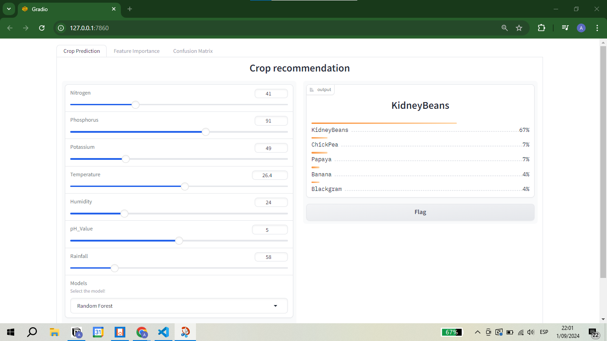
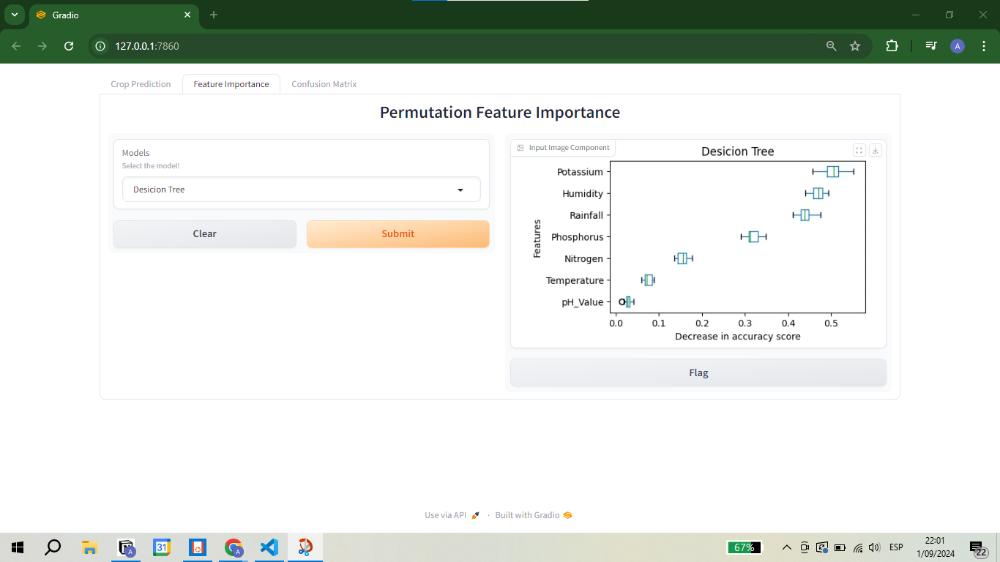
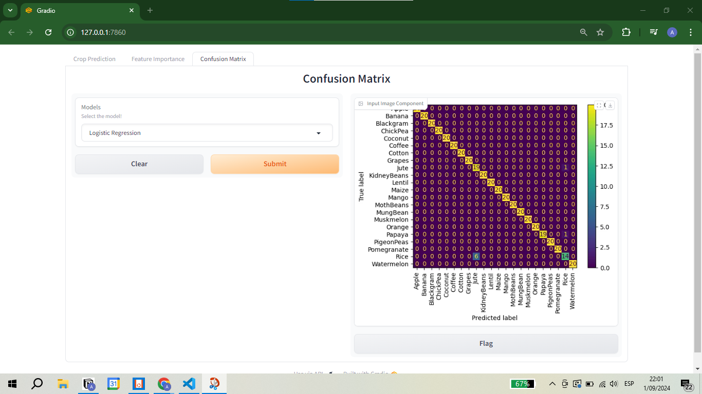

# IBM-Machine-Learning

## Course 1: Exploratory Data Analysis for Machine Learning

Artificial intelligence and machine learning started much earlier, but in recent times, with the help of power computing and the availability of data, the implementation of models has shown better results. One important part of the performance of a model in machine learning is the data. There are many ways of **retrieving and cleaning the data**, and we can also see the relationship between the features in the data by plotting, **exploratory data analysis**. Also, we need to process it before it is used to train a model, **feature engineering**. After processing the data and before training a model with it, one can raise hypotheses about the relationship between features of the data and test them; this is called **statistical hypothesis testing**. 

* **A brief History of Modern AI and its applications:** quick introduction to AI and Machine Learning and a brief history of the modern AI. We will also explore some of the current applications of AI and Machine Learning.
* **Retrieving and cleaning Data:** retrieve data from different sources, how to clean it to ensure its quality
* **Exploratory data analysis and Feature Engineering:** exploratory analysis to visually confirm it is ready for machine learning modeling by feature engineering and transformations.
* **Inferential statistics and Hypothesis testing:** useful definitions and simple examples that will help you get started creating hypothesis around your business problem and how to test them

### Project: Water Quality

Access to safe drinking-water is essential to health, a basic human right and a component of effective policy for health protection. This is important as a health and development issue at a national, regional and local level. In some regions, it has been shown that investments in water supply and sanitation can yield a net economic benefit, since the reductions in adverse health effects and health care costs outweigh the costs of undertaking the interventions.
[The water_potability.csv file contains water quality metrics for 3276 different water bodies.](https://www.kaggle.com/datasets/adityakadiwal/water-potability)

**Hypothesis**:
* Null hypothesis (H0): There is no difference in the mean of a numerical variable (for example, pH, hardness, TDS, etc.) between drinking water and non-potable water.
* Alternative hypothesis (H1): There is a difference in the mean of the numerical variable between drinking water and non-drinking water.

**Conclusion**: Based on the p-value results, the key factors affecting water potability are:

1. **H**: Critical for maintaining water safety.
2. **Chloramines**: Essential for proper disinfection but harmful at high levels.
3. **Organic Carbon**: Indicates the presence of natural organic matter, potentially harmful.
4. **Turbidity**: High levels indicate suspended particles and microorganisms.

Other factors like Hardness, Solids, Sulfate, Conductivity, and Trihalomethanes are not statistically significant in determining potability. Focus on controlling pH, chloramines, organic carbon, and turbidity to ensure safe drinking water.

## Course 2:
## Course 3: Supervised Machine Learning - Classification
Classification algorithms in machine learning categorize data into distinct classes. Here's a breakdown:
- **Logistic Regression** predicts the probability of binary outcomes, useful for cases where the response variable has two categories.
- **K-Nearest Neighbors (KNN)** classifies data by assigning it to the class most common among its k-nearest neighbors in the feature space.
- **Support Vector Classifier (SVC)** constructs a hyperplane that maximizes the margin between two classes, effectively finding the best boundary for classification.
- **Decision Trees** split data based on feature values, creating a tree-like structure where each node represents a decision rule and each branch represents an outcome.
- **Ensemble Models**:
  - **Random Forest** builds multiple decision trees and averages their predictions, improving accuracy and reducing overfitting.
  - **Bagging** (e.g., Random Forest) involves training multiple models on different subsets of the data and averaging their predictions.
  - **Boosting** (e.g., AdaBoost) trains models sequentially, with each model correcting errors made by the previous ones, thereby improving performance.
  - **Stacking** combines predictions from multiple models, usually different types, to form a final prediction, leveraging the strengths of each model.
- **Modeling Unbalanced Classes** involves techniques to handle situations where some classes are underrepresented, ensuring that the model performs well across all classes.

### Project: Crop prediction
In agriculture, the precise recommendation of crops is pivotal in ensuring optimal yield and sustainability. As farmers and agricultural experts delve deeper into data-driven approaches, the significance of leveraging comprehensive datasets, particularly those about soil composition, becomes increasingly evident. [The dataset under consideration embodies a wealth of information encompassing key factors such as Nitrogen, Phosphorus, and Potassium levels, alongside environmental variables like Temperature, Humidity, pH_Value, and Rainfall](https://www.kaggle.com/datasets/varshitanalluri/crop-recommendation-dataset). Understanding and analyzing this dataset is fundamental to making informed decisions that may enhance agricultural productivity, resource management, and overall crop health.

You can see the project by clicking on this [link](https://github.com/galois1915/IBM-Machine-Learning/tree/main/Supervised-Classification/project).

  
   
  

## Course 4: Unsupervised Machine Learning

* Introduction to Unsupervised Learning and K Means
* Distace Metrics and Computational Hurdles
* Selecting a Clustering Algorithm
* Dimensionality reduction
* Nonlinear and Distance-Based Dimentionality Reduction
* Matrix Factorization

## Course 5: Deep Learning and Reinforcement Learning
## Course 6: