# Report: Soil Clustering

## Overview Data Set
This dataset contains 7 columns. The first column contains names of different districts of country, India. And the rest of the columns contain the information about the Percent Composition of various minerals like Iron, Zinc, Copper, etc.
* [Nutrient Composition of Soil in different District](https://www.kaggle.com/datasets/ashishkumarak/soil-dataset)

**<class 'pandas.core.frame.DataFrame'>**
**RangeIndex: 673 entries, 0 to 672**
**Data columns (total 7 columns):**
| # | Column   | Non-Null Count | Dtype   |  
|---|----------|----------------|---------|  
| 0 | District | 673 non-null   | object  |  
| 1 | Zn %     | 658 non-null   | float64 |  
| 2 | Fe%      | 655 non-null   | float64 |  
| 3 | Cu %     | 651 non-null   | float64 |  
| 4 | Mn %     | 651 non-null   | float64 |  
| 5 | B %      | 608 non-null   | float64 |  
| 6 | S %      | 663 non-null   | float64 |  

**dtypes: float64(6), object(1)**  
**memory usage: 36.9+ KB**

## Objective
Group farms or crop types based on similarities in factors such as Area, Production, Annual Rainfall, Fertilizer usage, Pesticide usage, and Yield.

<!--
2. Anomaly Detection for Early Issue Identification
Objective: Identify unusual patterns or outliers in crop production data that may indicate problems like pest infestations, diseases, or adverse environmental conditions.
-->

### Methodology
In this analysis, we focused on a classification task using a dataset with well-distributed classes, eliminating the need for techniques to address class imbalance. The steps in the methodology are as follows:

**Data Preprocessing**:
- **Remove Null and duplicate values**: Remove the rows that have null values and the rows that have duplicate distric, end with one data for one district.
- **Scaling**: The data was scaled using the `StandardScaler` function to normalize feature values and enhance model performance.

   Also, I separate the name distric from data.

  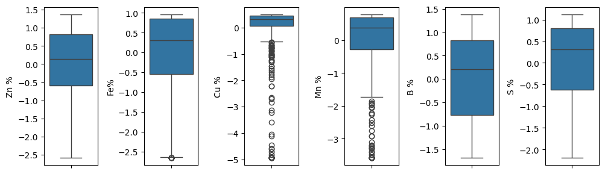

**Apply PCA**:
- We apply PCA and PCA kernel to reduce dimension or find relationship between columns, respectively. 

**Applying models**:
- K Means Clustering, DBSCAN, Gaussian Mixture, Mean Shift

**Model Saving**:
- The final trained model was saved using the `pickle` library for future use.

**Evaluation**:
- **Inertia** measures how well a dataset was clustered by K-Means. It is calculated by measuring the distance between each data point and its centroid, squaring this distance, and summing these squares across one cluster.
- **calinski harabasz** is a metric for evaluating clustering algorithms, introduced by Tadeusz Caliński and Jerzy Harabasz in 1974. It is an internal evaluation metric, where the assessment of the clustering quality is based solely on the dataset and the clustering results, and not on external, ground-truth labels.
- **AIC (Akaike Information Criterion):** Measures model fit and complexity. Lower AIC indicates a better model.

- **BIC (Bayesian Information Criterion):** Similar to AIC but with a heavier penalty for more parameters. Lower BIC suggests a better model.

These steps were implemented primarily using `pandas` for data manipulation and `sklearn` for scaling, and modeling, you can see the notebook by clicking on this [link](https://github.com/galois1915/IBM-Machine-Learning/blob/main/Unsupervised-MachineLearning/project/project_notebook.ipynb).

## Results and Discussion:
It doesn't improve after applying PCA, then we add more dimension using PCA Kernel.

  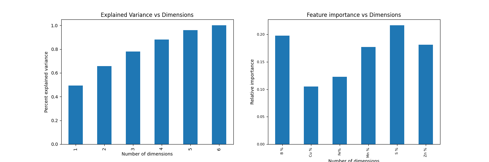

Using the K Means algorithm for clustering, we can see that the correct number of clusters is four; this can be seen viewing the inertia graph, using the original data or the data with more dimensions.

  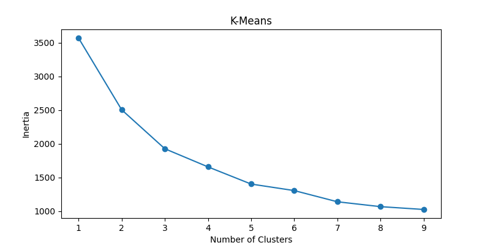
  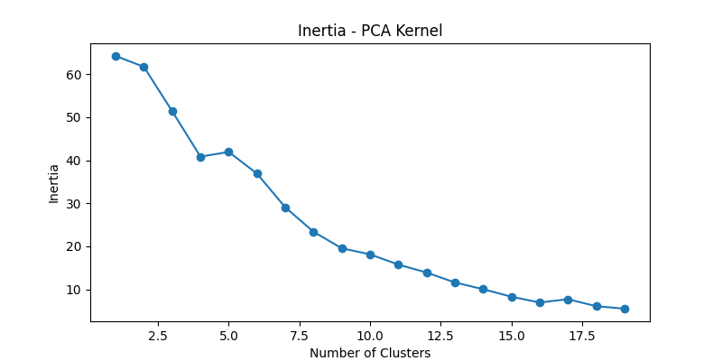

After testing different types of epsilons, we can find that values greater than 0.4 are appropriate, obtaining the highest values in the score. Varying the number of samples will have high values for four samples, then give us 2 clusters.

  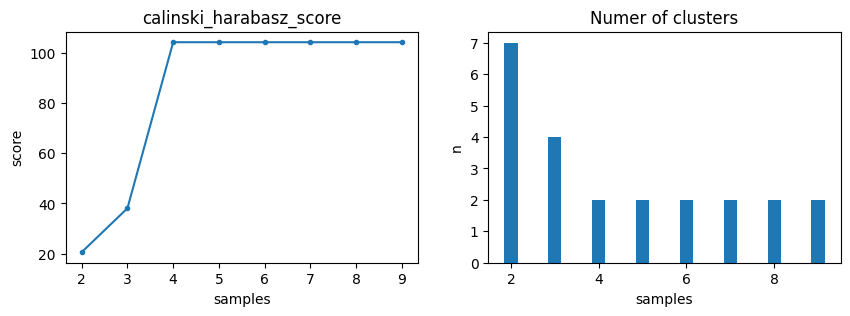

The evaluation in the model Gaussian Mixture is more complicated, but after testing different parameters, we can find high values in Calinski Harabasz for four clusters and low values for bic and aic; this deduction was more clear using the original data with more dimension.

  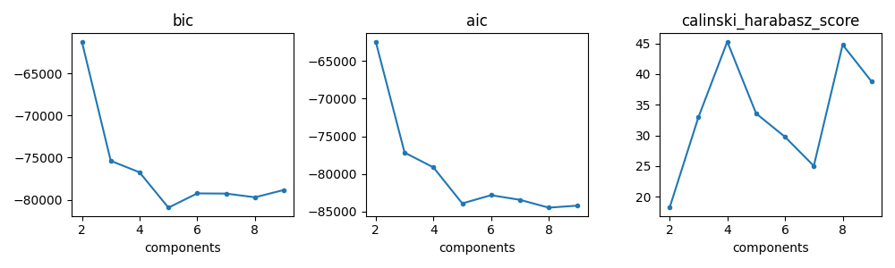

The model Mean Shift automatically determines the number of clusters, depending on the parameters. In this case, varying the bandwidth, we can see that value of approximately 3 is appropriate since we can have a high value in Calinski Harabasz but only will have two clusters.

  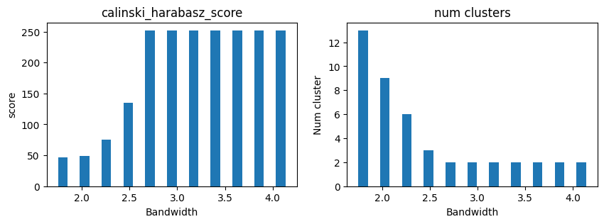

### Conclusion
The analysis aimed to group soil samples based on mineral composition revealed that K-Means clustering with four clusters was the most effective, as supported by inertia graphs and PCA results. DBSCAN showed good performance with `eps` values above 0.4 and four samples, yielding two clusters. Gaussian Mixture Models also indicated four clusters as optimal based on Calinski-Harabasz scores and low BIC and AIC values. Mean Shift suggested approximately three clusters, but with high Calinski-Harabasz scores and only two clusters observed. Overall, four clusters emerged as the most consistent and optimal solution across different methods and metrics.

  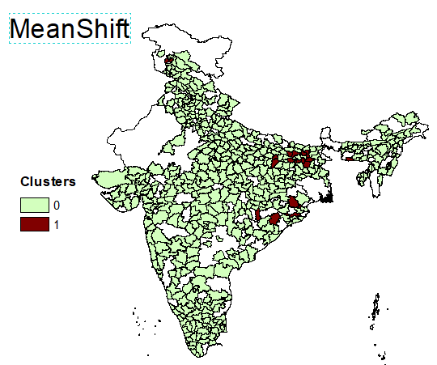
  
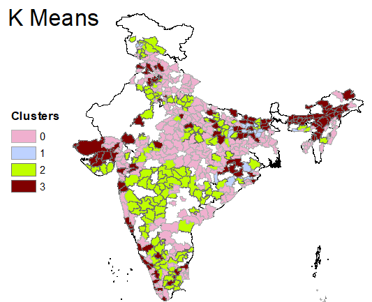
  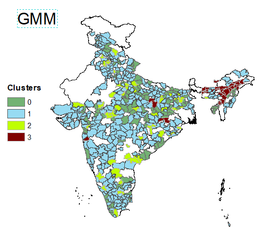
  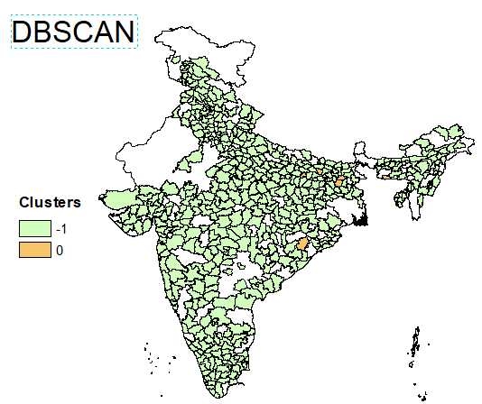

